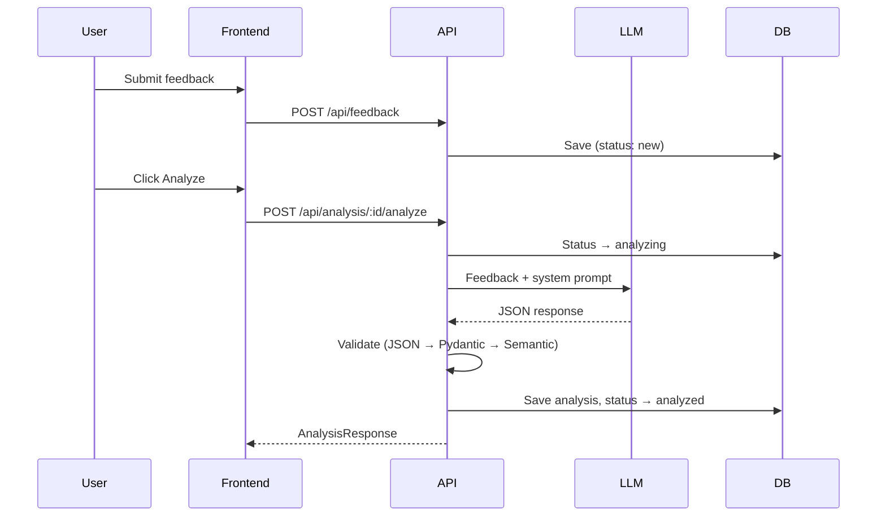
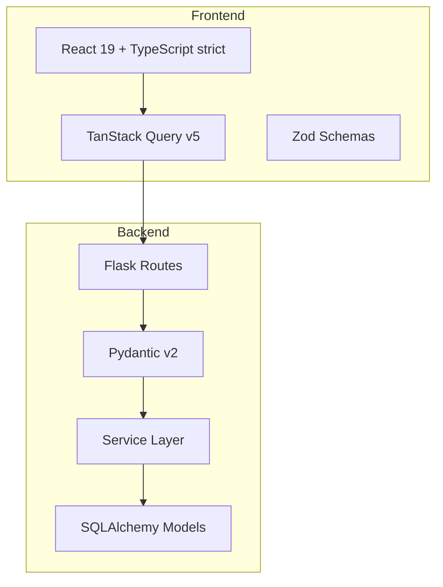
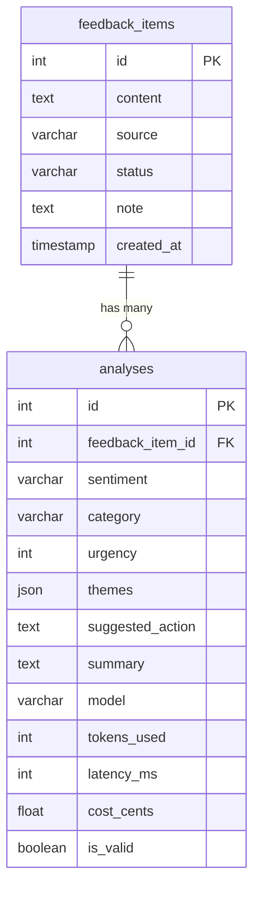
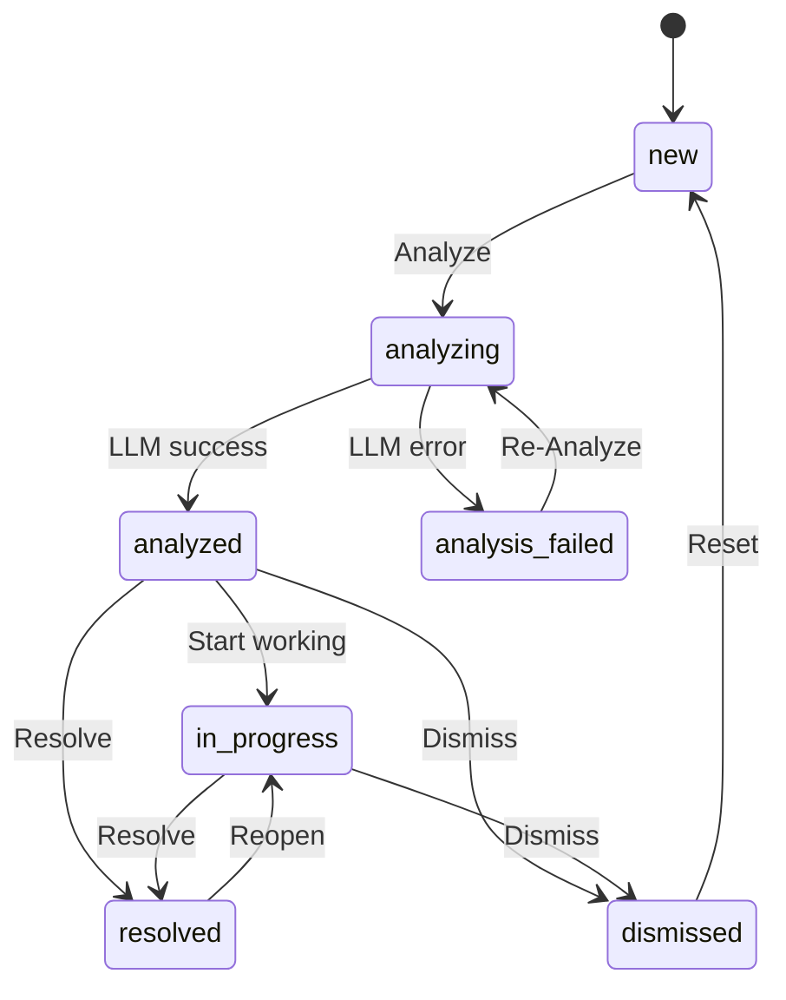

# EchoLog

**AI-Powered Customer Feedback Triage**

EchoLog helps product teams collect, analyze, and act on customer feedback. Paste raw feedback, click Analyze, and get structured insights in seconds: sentiment, category, urgency, themes, and suggested actions. Every analysis is validated, logged, and traceable.

**Live Demo**: [http://143.198.181.116](http://143.198.181.116)

## Quick Start

```bash
git clone https://github.com/hitakshiA/Echolog.git && cd Echolog

# Setup
cp .env.example .env    # Edit .env → set your OPENAI_API_KEY

# Backend (Terminal 1)
cd backend && python3 -m venv .venv && source .venv/bin/activate
pip install -e ".[dev]"
export FLASK_APP=app:create_app
flask db upgrade && flask run --debug

# Frontend (Terminal 2)
cd frontend && npm install && npm run dev
```

Open http://localhost:5173. Both servers must run simultaneously.

**Docker alternative** (single command):
```bash
docker compose up --build
```

## How It Works



---

## Evaluation Criteria Mapping

Each section below maps directly to Better's 10 evaluation criteria with concrete evidence.

### 1. Structure — Clear boundaries and logical organization

**Three-layer architecture** with strict separation:

```
Routes (thin controllers) → Services (business logic) → Models (data access)
```

- **Routes** parse input via Pydantic, call a service method, return a Pydantic response. Zero business logic.
- **Services** are plain Python classes. They receive a db session as a constructor argument. They never import Flask.
- **Models** use SQLAlchemy 2.0 `Mapped[]` types. They define data shape only.

Two Flask blueprints (`feedback`, `analysis`) with zero cross-imports. A third (`analytics`) handles read-only aggregation. Each blueprint owns one domain.



**Test evidence**: `TestStructure` — verifies services have no Flask imports, routes delegate to services, blueprints work independently.

### 2. Simplicity — Readable, predictable code

- **Two database tables**: `feedback_items` and `analyses`. That's it.
- **State machine**: A dictionary lookup (`VALID_TRANSITIONS`), not a state pattern with abstract classes.
- **No metaclasses**, no decorators beyond Flask's `@route`, no abstract base classes.
- **Six service files** total. Every function does one thing.



**Test evidence**: `TestSimplicity` — verifies state machine is a dict, database has exactly 2 tables.

### 3. Correctness — Prevents invalid states and enforces rules

Every feedback item follows a strict state machine. Invalid transitions return 422 with the allowed transitions listed:



- Content must be 10–10,000 characters (Pydantic `Field(min_length=10, max_length=10000)`)
- Urgency has a `CHECK` constraint: `1 ≤ urgency ≤ 5`
- Source, status, sentiment, category are all typed enums — never raw strings

**Test evidence**: `TestCorrectness` — verifies invalid transitions rejected with 422, content validation enforced, all statuses covered.

### 4. Interface Safety — Guards against misuse

Validation happens at three boundaries:

| Boundary | Tool | What it catches |
|----------|------|----------------|
| API input | Pydantic v2 | Invalid types, missing fields, enum violations, length constraints |
| LLM output | Pydantic + semantic checks | Bad JSON, wrong enums, urgency out of range, empty themes |
| Frontend forms | Zod + react-hook-form | Same constraints as Pydantic, caught before the request is sent |

The LLM validation pipeline has three steps:
1. **JSON Parse** — catch non-JSON responses
2. **Schema Validation** — Pydantic checks all field types, enums, constraints (collects ALL errors, not fail-fast)
3. **Semantic Checks** — urgency=5 only with negative/urgent sentiment, non-empty themes, summary 10–500 chars

**Test evidence**: `TestInterfaceSafety` — verifies invalid enums rejected, LLM output with bad sentiment caught, urgency out of range caught.

### 5. Change Resilience — New features don't cause widespread impact

| Change | Files affected | Existing code modified |
|--------|---------------|----------------------|
| Add new LLM provider | 1 new adapter in `llm_service.py` | 0 |
| Add new feedback source | 1 enum value in `enums.py` | 0 |
| Add background queue | 1 new `tasks.py` | 0 service changes |
| Add authentication | 1 new model, query filters | 0 structural changes |
| Add webhook ingestion | 1 new blueprint | 0 existing changes |

Blueprints are independent — changing analytics cannot break feedback. Services don't know about HTTP. Models don't know about services.

**Test evidence**: `TestChangeResilience` — verifies adding feedback doesn't break analytics, history works on unanalyzed items.

### 6. Verification — Automated tests proving behavior remains correct

```bash
# Run all tests
cd backend && pytest -v          # 134+ backend tests
cd frontend && npx vitest run    # 34 frontend tests

# Coverage
cd backend && pytest --cov=app --cov-report=term-missing
```

| Test category | Count | What it proves |
|--------------|-------|---------------|
| ValidationService unit tests | ~35 | Every validation constraint works (missing fields, bad enums, semantic checks) |
| State machine unit tests | ~43 | Every valid transition accepted, every invalid transition rejected |
| Feedback API integration | ~15 | CRUD, pagination, filtering, status transitions |
| Analysis API integration | ~7 | Analyze with mocked LLM, re-analyze, history |
| Evaluation criteria tests | ~28 | Each of the 10 criteria has test evidence |
| Frontend component tests | 34 | Badge, Button, AnalysisPanel, FeedbackTable |

All LLM tests use a `mock_llm` fixture — never real API calls.

**Test evidence**: `TestVerification` — full CRUD lifecycle, end-to-end analysis with mocked LLM, validation collects all errors.

### 7. Observability — Failures are visible and diagnosable

- **structlog** with JSON output in production, console in development
- Every request gets a **`request_id` UUID** propagated through all log entries (`X-Request-ID` response header)
- Every LLM call logs: `model`, `tokens_used`, `latency_ms`, `cost_cents`, `validation.is_valid`
- All errors return a consistent JSON structure:

```json
{
  "error": {
    "code": "INVALID_STATUS_TRANSITION",
    "message": "Cannot transition from new to resolved",
    "details": { "current": "new", "requested": "resolved", "allowed": ["analyzing"] }
  }
}
```

- **Health endpoint** (`GET /api/health`) reports database connectivity, app version, and uptime

**Test evidence**: `TestObservability` — verifies error codes are machine-readable, transition errors include allowed list, health endpoint works, `X-Request-ID` header present.

### 8. AI Guidance — Clear instructions constraining AI behavior

Two guidance files constrain AI behavior:

- **`AGENTS.md`** — Constrains AI coding assistants: forbidden patterns (no `print()`, no `Column()`, no raw SQL, no business logic in routes), project structure, testing requirements
- **`ANALYSIS_SYSTEM_PROMPT`** — Stored as a versioned constant in `validation_service.py` (not dynamically generated). Constrains LLM output to a strict JSON schema with explicit rules:
  - Urgency 5 reserved for data loss, security issues, service outages
  - Themes must be concrete nouns, not abstract concepts
  - Suggested action must be actionable ("Fix the login timeout" not "Look into the issue")

The validation pipeline enforces these constraints — if the LLM drifts, the system catches it and flags the failure.

**Test evidence**: `TestAIGuidance` — verifies system prompt is a constant, semantic checks catch urgency/sentiment mismatches, AGENTS.md exists.

### 9. AI Usage — Generated code is critically reviewed and verified

This project was built with Claude Code (Anthropic) as a pair-programming assistant.

**What I designed (human decisions):**
- Product concept, state machine transitions, validation pipeline design, data model
- Architecture decisions: three-layer pattern, Pydantic-everywhere strategy
- Tradeoff decisions: synchronous LLM calls, SQLite for dev, no auth, two tables

**What AI generated (with my direction):**
- Scaffolding, boilerplate, SQLAlchemy models, Pydantic/Zod schemas, route handlers
- Service logic, React components, test case generation, documentation

**What I reviewed and changed:**
- Fixed state machine: AI initially allowed `analyzed → new` (invalid per spec)
- Added semantic validation: AI only generated JSON + schema checks; I added urgency/sentiment cross-validation
- Improved error messages: changed generic errors to include context (current status, allowed transitions)
- Added `LLMConfigError` guard: app fails clearly instead of crashing with a cryptic OpenAI error
- Redesigned UI twice after generation to match the target aesthetic

### 10. Communication — Tradeoffs and weaknesses explained clearly

Each decision below states **what** was chosen, **why**, and **what was given up**.

| Decision | Why | Gave up |
|----------|-----|---------|
| **Synchronous LLM calls** (no queue) | Queue adds 3 infra dependencies for a single-user tool. State machine already models async flow. | Cannot bulk-analyze 100+ items in parallel |
| **Pydantic v2** (not Marshmallow) | One validation library for API input + LLM output. Rust core is faster. Both OpenAI/Anthropic SDKs use Pydantic. | No native Flask integration; manual `request.get_json()` |
| **SQLite** (not PostgreSQL) | Zero-config. Works with `flask run` — no Docker needed. | No full-text search index; `LIKE` is O(n) |
| **Two tables** (not three) | Fixed taxonomy (6 categories, 5 sentiments). No CRUD for category management. | Can't add custom categories without code change |
| **No authentication** | Auth is boilerplate, not architecture. Doesn't demonstrate structure or correctness. | Single-user only |

**Known weaknesses:**

| Weakness | Mitigation |
|----------|-----------|
| SQLite won't scale past ~10K items | `DATABASE_URL` switches to PostgreSQL with zero code changes |
| LLM calls block for up to 30s | State machine already models async; queue is a 1-file addition |
| No rate limiting on LLM calls | Every call logged with cost; monitoring catches abuse |
| `datetime.utcnow()` deprecation warning | Non-breaking in Python 3.12; migration needed to fix |

---

## Tech Stack

| Layer | Technology | Purpose |
|-------|-----------|---------|
| Backend | Flask 3 | Web framework (app factory pattern) |
| ORM | SQLAlchemy 2.0 | Database access (`Mapped[]` types) |
| Validation | Pydantic v2 | API + LLM output validation |
| Database | SQLite (dev) / PostgreSQL (prod) | Data persistence |
| Logging | structlog | Structured JSON logging with `request_id` |
| Frontend | React 19 + TypeScript (strict) | UI framework |
| Styling | Tailwind CSS v4 | Utility-first CSS |
| State | TanStack Query v5 | Server state management |
| Forms | react-hook-form + Zod | Client-side validation |
| Charts | recharts | Analytics visualizations |
| Testing | pytest + Vitest + RTL | 160+ automated tests |
| Linting | Ruff + ESLint | Code quality |
