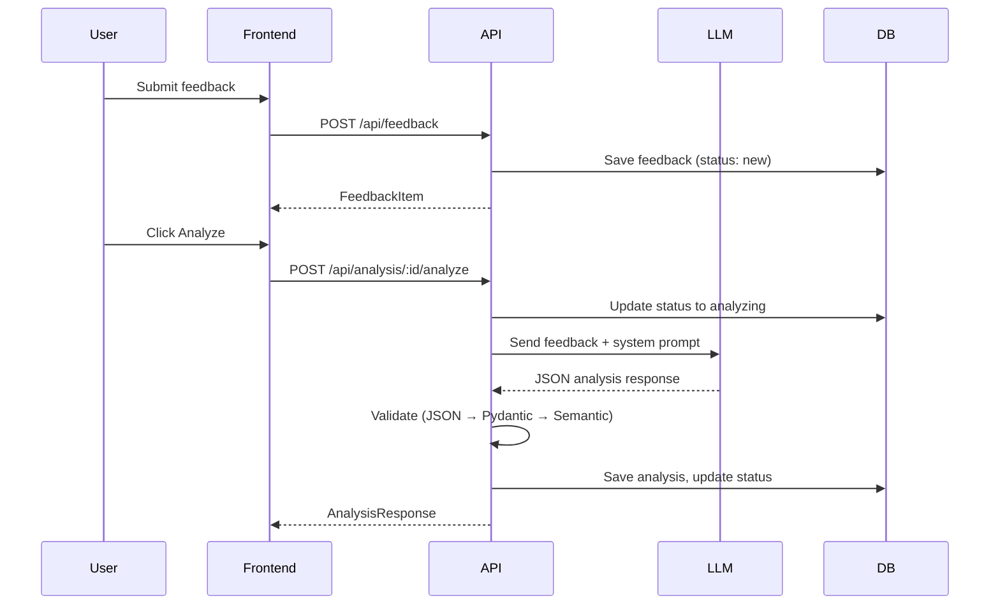
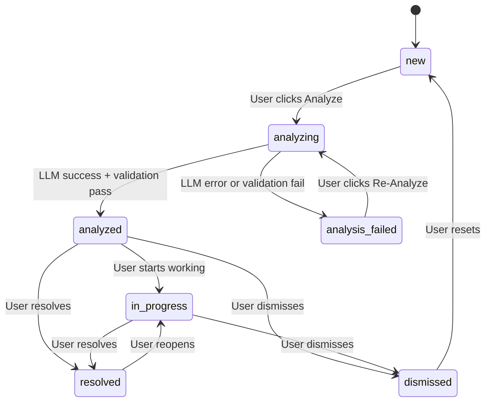
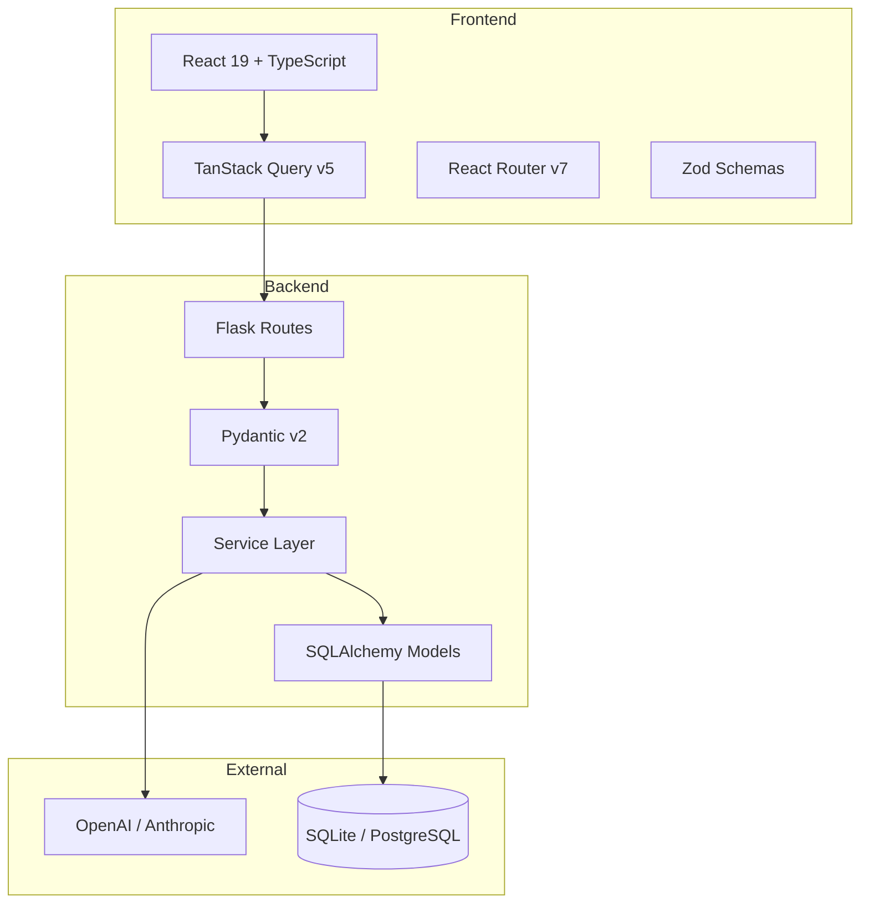
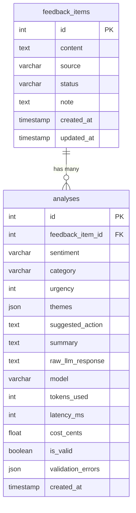

# EchoLog

AI-Powered Customer Feedback Triage

EchoLog helps product teams collect, analyze, and act on customer feedback. Paste raw feedback text, click Analyze, and get structured insights in seconds: sentiment, category, urgency, themes, and suggested actions.

## Quick Start

```bash
# Clone
git clone https://github.com/hitakshiA/Echolog.git
cd Echolog

# Backend
cd backend
python3 -m venv .venv
source .venv/bin/activate
pip install -e ".[dev]"
flask db upgrade
flask run --debug

# Frontend (new terminal)
cd frontend
npm install
npm run dev
```

Open http://localhost:5173 to use the app.

## How It Works



## State Machine



## Architecture



**Three-layer architecture**: Routes (thin controllers) → Services (business logic) → Models (data access). No layer skipping.

## Data Model



## Tech Stack

| Layer | Technology | Purpose |
|-------|-----------|---------|
| Backend | Flask 3 | Web framework |
| ORM | SQLAlchemy 2.0 | Database access (Mapped types) |
| Validation | Pydantic v2 | Request/response/LLM validation |
| Database | SQLite (dev) / PostgreSQL (prod) | Data persistence |
| Logging | structlog | Structured JSON logging |
| Frontend | React 19 + TypeScript | UI framework (strict mode) |
| Styling | Tailwind CSS v4 | Utility-first CSS |
| Routing | React Router v7 | Client-side routing |
| Server State | TanStack Query v5 | Data fetching + caching |
| Forms | react-hook-form + Zod | Form validation |
| Charts | recharts | Analytics visualizations |
| Testing | pytest + Vitest + RTL | Backend + frontend tests |
| Linting | Ruff + ESLint | Code quality |

## Key Technical Decisions

### Synchronous LLM Calls
LLM analysis runs in the request cycle with a 30s timeout. A background queue (Celery/Redis) would add infrastructure complexity disproportionate to the single-user use case. The state machine already models async flow if needed later.

### Pydantic v2 Over Marshmallow
Pydantic validates API requests, responses, AND LLM output — one library, one mental model. Its Rust core is significantly faster, and it's the standard in the LLM SDK ecosystem.

### SQLite for Development
Zero-config, embedded database. No Docker dependency for reviewers. PostgreSQL supported via `DATABASE_URL` env var for production.

### Two Tables, Not Three
Categories and sentiments are enums, not user-defined entities. This avoids CRUD/UI complexity for category management while keeping the taxonomy consistent.

### No Authentication
Auth adds significant scope that doesn't demonstrate the evaluation criteria. It's boilerplate, not architecture. Multi-user would be a clean extension.

## Validation Pipeline

Every LLM response passes through three validation steps:

1. **JSON Parse** — Verify the raw text is valid JSON
2. **Schema Validation** — Pydantic checks all field types, enums, constraints (collects ALL errors)
3. **Semantic Checks** — urgency=5 only with negative/urgent sentiment, non-empty themes, summary 10-500 chars

## Testing

```bash
# Backend (100 tests)
cd backend && pytest -v

# Frontend (34 tests)
cd frontend && npx vitest run

# Backend coverage
cd backend && pytest --cov=app --cov-report=term-missing
```

- **Unit tests**: ValidationService (~35 cases), State machine (~43 cases)
- **Integration tests**: Feedback API CRUD, Analysis API with mocked LLM
- **Frontend tests**: Badge, Button, AnalysisPanel, FeedbackTable

## Observability

- **structlog** with JSON output in production, console in development
- Every request gets a `request_id` UUID propagated through all logs
- Every LLM call logs: model, tokens, latency, cost, validation result
- `X-Request-ID` response header for request tracing

## AI Usage

This project was built with assistance from Claude Code (Anthropic). Key areas:

- **Scaffolding**: Project structure, boilerplate, configuration files
- **Implementation**: Service layer logic, API routes, React components
- **Testing**: Test case generation and fixture setup
- **Documentation**: README, AGENTS.md

All AI-generated code was reviewed for correctness, naming consistency, and alignment with the spec. The AGENTS.md file constrains AI coding assistants working on this codebase.

## Extension Points

| Feature | Impact | Changes |
|---------|--------|---------|
| Background Queue | Add Celery + Redis | 1 new file (tasks.py), 0 service changes |
| Multi-Provider LLM | Add Anthropic adapter | 1 adapter file, 0 validation changes |
| Webhook Ingestion | External sources | 1 new blueprint, 0 existing changes |
| Authentication | Multi-user | 1 new model, query filter changes |
| CSV Export | Data export | 1 new endpoint |
