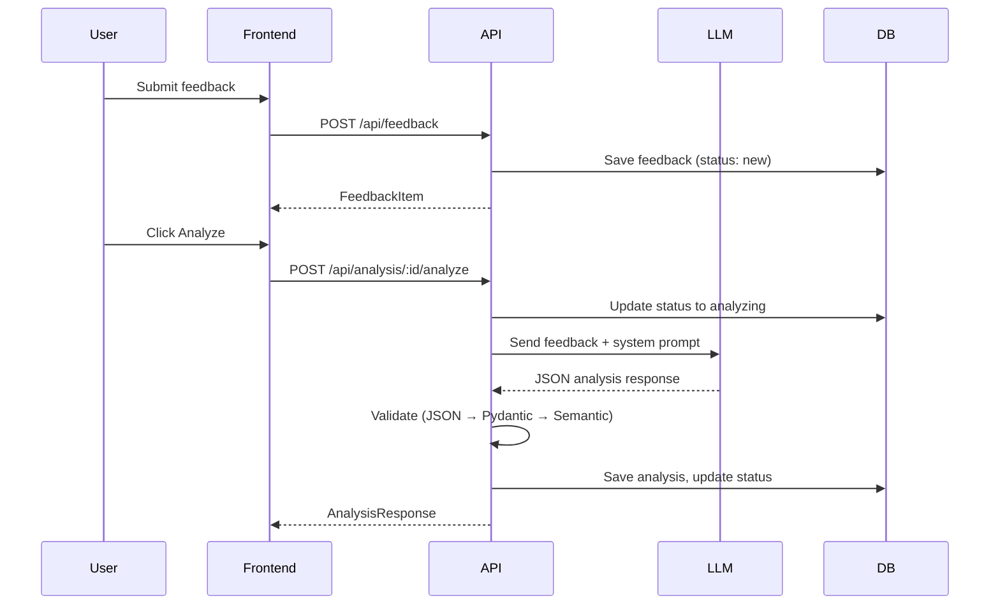
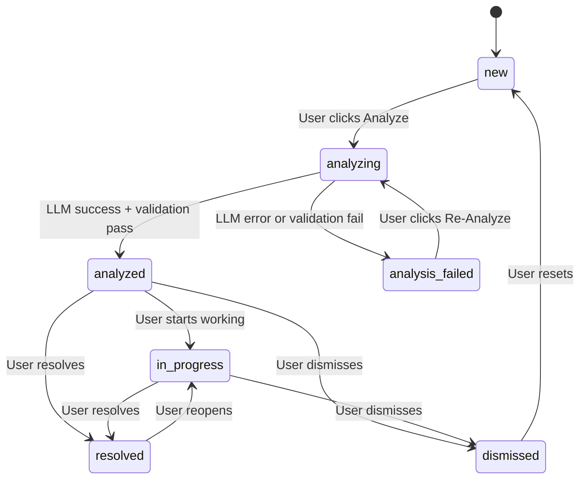
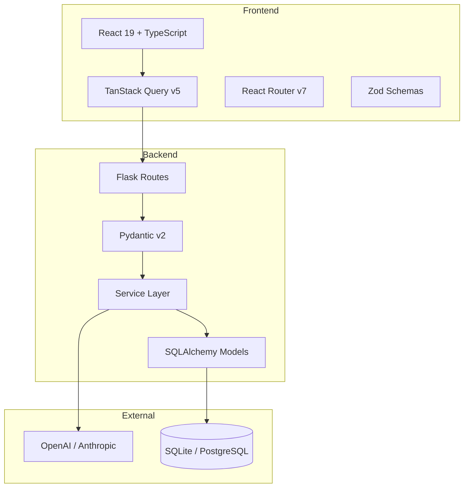
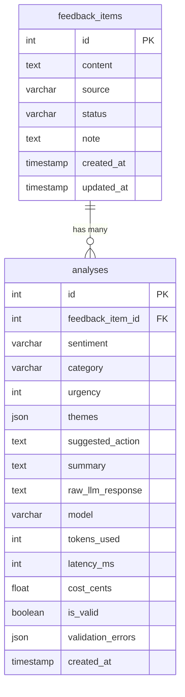

# EchoLog

AI-Powered Customer Feedback Triage

EchoLog helps product teams collect, analyze, and act on customer feedback. Paste raw feedback text, click Analyze, and get structured insights in seconds: sentiment, category, urgency, themes, and suggested actions.

## Quick Start

```bash
# Clone
git clone https://github.com/hitakshiA/Echolog.git
cd Echolog

# Environment setup
cp .env.example .env
# Edit .env and set OPENAI_API_KEY to your real key

# Backend (Terminal 1)
cd backend
python3 -m venv .venv
source .venv/bin/activate
pip install -e ".[dev]"
export FLASK_APP=app:create_app
flask db upgrade
flask run --debug

# Frontend (Terminal 2)
cd frontend
npm install
npm run dev
```

Open http://localhost:5173. Both servers must be running simultaneously — the frontend proxies API requests to the backend via Vite.

## How It Works



## State Machine



## Architecture



**Three-layer architecture**: Routes (thin controllers) → Services (business logic) → Models (data access). No layer skipping.

## Data Model



## Tech Stack

| Layer | Technology | Purpose |
|-------|-----------|---------|
| Backend | Flask 3 | Web framework |
| ORM | SQLAlchemy 2.0 | Database access (Mapped types) |
| Validation | Pydantic v2 | Request/response/LLM validation |
| Database | SQLite (dev) / PostgreSQL (prod) | Data persistence |
| Logging | structlog | Structured JSON logging |
| Frontend | React 19 + TypeScript | UI framework (strict mode) |
| Styling | Tailwind CSS v4 | Utility-first CSS |
| Routing | React Router v7 | Client-side routing |
| Server State | TanStack Query v5 | Data fetching + caching |
| Forms | react-hook-form + Zod | Form validation |
| Charts | recharts | Analytics visualizations |
| Testing | pytest + Vitest + RTL | Backend + frontend tests |
| Linting | Ruff + ESLint | Code quality |

## Key Technical Decisions

Each decision is framed as: **what** was chosen, **why**, and **what was given up**.

### Synchronous LLM Calls
**Chose**: Synchronous request-response with 30s timeout.
**Over**: Celery + Redis background queue.
**Why**: A queue adds 3 infrastructure dependencies (Redis, Celery worker, result backend) for a single-user tool where the user clicks "Analyze" and waits. The state machine already models the async flow (`new → analyzing → analyzed`), so adding a queue later requires zero service layer changes — only a new `tasks.py` file.
**Gave up**: Cannot bulk-analyze 100+ items in parallel.

### Pydantic v2 Over Marshmallow
**Chose**: Pydantic v2 for all validation (API + LLM output).
**Over**: Marshmallow, flask-restx, or separate validation libraries.
**Why**: One validation library, one mental model. Pydantic validates API requests, API responses, AND LLM output with the same schemas. Its Rust core is faster, and both OpenAI and Anthropic SDKs use Pydantic internally.
**Gave up**: No native Flask integration (unlike FastAPI). Requires manual `request.get_json()` parsing in routes.

### SQLite for Development
**Chose**: SQLite as the default database.
**Over**: Requiring PostgreSQL/Docker for setup.
**Why**: Zero configuration. The app works with `flask db upgrade && flask run` — no Docker, no database server. The schema uses only standard SQL types, so switching to PostgreSQL requires only changing `DATABASE_URL`.
**Gave up**: No full-text search index (uses `LIKE` which is O(n)). Acceptable for <10K items.

### Two Tables, Not Three
**Chose**: Categories and sentiments as Python enums.
**Over**: A separate `categories` table with CRUD management.
**Why**: The taxonomy is fixed and small (6 categories, 5 sentiments). A categories table would require its own CRUD endpoints, management UI, and migration complexity — all for a feature the user didn't ask for.
**Gave up**: Users cannot add custom categories without a code change.

### No Authentication
**Chose**: Single-user tool with no auth.
**Over**: Flask-Login, JWT, or OAuth.
**Why**: Authentication is boilerplate — it doesn't demonstrate structure, correctness, or change resilience. The extension path is clean: add a `users` table, a `user_id` FK on `feedback_items`, and query filters.

## Validation Pipeline

Every LLM response passes through three validation steps:

1. **JSON Parse** — Verify the raw text is valid JSON
2. **Schema Validation** — Pydantic checks all field types, enums, constraints (collects ALL errors)
3. **Semantic Checks** — urgency=5 only with negative/urgent sentiment, non-empty themes, summary 10-500 chars

## Testing

```bash
# Backend (100 tests)
cd backend && pytest -v

# Frontend (34 tests)
cd frontend && npx vitest run

# Backend coverage
cd backend && pytest --cov=app --cov-report=term-missing
```

- **Unit tests**: ValidationService (~35 cases), State machine (~43 cases)
- **Integration tests**: Feedback API CRUD, Analysis API with mocked LLM
- **Frontend tests**: Badge, Button, AnalysisPanel, FeedbackTable

## Observability

- **structlog** with JSON output in production, console in development
- Every request gets a `request_id` UUID propagated through all logs
- Every LLM call logs: model, tokens, latency, cost, validation result
- `X-Request-ID` response header for request tracing

## AI Usage

This project was built with Claude Code (Anthropic) as a pair-programming assistant. Here is a transparent breakdown of what was AI-generated, what was human-directed, and what was changed after generation.

### What I designed (human decisions)
- **Product concept**: Chose feedback triage as the domain; designed the state machine transitions, validation pipeline, and data model
- **Architecture**: Decided on three-layer pattern, Pydantic-everywhere strategy, and the choice to validate LLM output with the same tools used for API validation
- **Tradeoff decisions**: Synchronous LLM calls, SQLite for dev, no auth, two tables not three — these were deliberate scope choices, not defaults
- **AI guidance strategy**: Wrote AGENTS.md constraints and the system prompt; iterated on the validation pipeline rules based on observing actual LLM output

### What AI generated (with my direction)
- **Scaffolding**: Flask app factory, config classes, pyproject.toml, Vite setup, Tailwind config
- **Boilerplate**: SQLAlchemy models, Pydantic schemas, Zod schemas, TanStack Query hooks, route handlers
- **Service logic**: FeedbackService CRUD, AnalysisService orchestration, LLMService provider abstraction, ValidationService pipeline
- **React components**: All UI components (Button, Badge, Card, Modal), dashboard, detail, analytics pages
- **Tests**: Test case generation for ValidationService (~35 cases), state machine (~43 cases), integration tests, frontend tests
- **Documentation**: README structure, mermaid diagrams

### What I reviewed and changed after generation
- **State machine logic**: Verified every transition edge case — the AI initially allowed `analyzed → new` which should not be valid; fixed to match spec
- **Validation pipeline**: Added semantic checks (urgency=5 requires negative/urgent sentiment) after the AI only generated JSON + schema validation
- **Error handling**: Changed generic error messages to include specific context (current status, requested status, allowed transitions)
- **LLM config guard**: Added the `LLMConfigError` check so the app fails clearly instead of crashing with a cryptic OpenAI error when the API key is missing
- **Import organization**: Moved late imports to module level, removed unused imports flagged by ruff
- **UI iterations**: Redesigned the UI twice after initial generation to match the Cycle.dev-inspired aesthetic from the spec

### AI guidance files
- **`AGENTS.md`**: Constrains AI coding assistants — defines forbidden patterns (no `print()`, no `Column()`, no raw SQL, no business logic in routes), project structure, and testing requirements
- **System prompt** (`ANALYSIS_SYSTEM_PROMPT`): Stored as a versioned constant in `validation_service.py`, not dynamically generated. Constrains LLM output to a strict JSON schema with explicit rules for edge cases

## Known Weaknesses & Risks

These are deliberate tradeoffs, not oversights:

| Weakness | Why it exists | Mitigation |
|----------|--------------|------------|
| **SQLite won't scale** past ~10K items | Zero-config setup for reviewers; no Docker needed | `DATABASE_URL` env var switches to PostgreSQL with zero code changes |
| **Synchronous LLM calls** block the request for up to 30s | Background queue (Celery/Redis) adds 3 infrastructure dependencies for a single-user tool | State machine already models async flow; adding a queue is a 1-file change |
| **No authentication** | Auth is boilerplate, not architecture; doesn't demonstrate evaluation criteria | Add Flask-Login + user FK; query filters scope data per user |
| **No rate limiting** on LLM calls | Would need Redis for distributed rate limiting | Each call is logged with cost; monitoring catches abuse |
| **SQLite in serverless** (Railway) won't persist across deploys | Acceptable for demo; data is ephemeral | Switch to Railway's PostgreSQL addon for persistence |
| **`datetime.utcnow()` deprecation** | Changing to `datetime.now(UTC)` would require a new migration | Non-breaking; only a warning in Python 3.12 |

## Extension Points

| Feature | Impact | Changes |
|---------|--------|---------|
| Background Queue | Add Celery + Redis | 1 new file (tasks.py), 0 service changes |
| Multi-Provider LLM | Add Anthropic adapter | 1 adapter file, 0 validation changes |
| Webhook Ingestion | External sources | 1 new blueprint, 0 existing changes |
| Authentication | Multi-user | 1 new model, query filter changes |
| CSV Export | Data export | 1 new endpoint |
